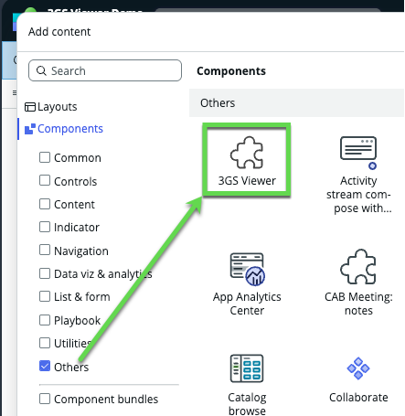

# 3 GS Viewer Custom Component

This is a custom component for ServiceNow based on the UX Framework. The component uses the [Three.JS](https://threejs.org/) library to allow rendering of 3D files in a ServiceNow page. Here is an exmaple how this can look in its simplest form:


You may use this repo / component as instructional or inspirational, it has not been fully tested or vetted for a productive use. I am in no shape or form a professional when it comes to using the Three.js library and its functionality or its risks.

Other resources to checkout:

- [Next Experience Center of Excellence](https://www.servicenow.com/community/next-experience-articles/next-experience-center-of-excellence/ta-p/2332092) - This is the main place where our Developer Advocates post Next Experience, Workspace, and UI Builder enablement materials.
- [ThreeJS](https://threejs.org/) - This is the library used in this component
- [My NowBytes](https://www.youtube.com/@DanielNOWBytes/) - My YouTube chanel where I randomly post content around anyhting ServiceNow that I find interesting enough. No video on this component yet, but who knows. Let me know if I should do one.

## Content

- [Why?](#why-)
- [What?](#what-)
- [How?](#how-)

## Why ?

Some time ago I was on a customer hackathon, always a great place and time to be with lovely and cretaive minds. One of these minds approached me and asked 'Can ServiceNow work with 3JS files?' I had no idea if, but I was pretty sure we can make it happen. The use case presented made sense and actually, I can see a lot of other use cases where this can be useful. Image you produce heavy machinery and want to help your technicans with detailed instructions on how to repair or maintain these, or you want to have a digital twin of your products or facilities ... could be used to navigate customers through the campus, right?

Well, long story short, I was interessted and started digging around. This repository is one of the results.

## What ?

Based on the customer request I wanted to create a component to be used on any modern UX Framework based page. The component needs to contain the 3JS viewer and render a defined 3D file. The file needs to be stored on ServiceNow.

A custom component is for sure not a low-code capability anymore. You should be fine with command lines, VS Code (or similar) as editor and the general developer contexts of JavaScript.

## How ?

This section will explain the steps required to make this component work. I will refer to other available instructions or resources where applicable.

### ServiceNow CLI

You will need the [ServiceNow CLI](https://store.servicenow.com/store/app/ee71f36a1ba46a50a85b16db234bcbd4). If you have issues downloading it from the official store, there is also a GitHub repo at [@ServiceNow/servicenow-cli](https://github.com/ServiceNow/servicenow-cli) - just verify it has the latest version as it might not be updated as regularly as the store itself.

Follow this [guide](https://developer.servicenow.com/dev.do#!/reference/next-experience/xanadu/cli/getting-started) on how to install the CLI. It will also ask you to install NPM and NODE.JS in a specific version each. Make sure you have the extact version mentioned, otherwise the CLI will not work as it should.

You also need to install the ui-component extension to get all the features required for building custom UI components. The instructions are on the same page.

### Start a new project / component

A good reference to start building your own custom component is also on the [developer page](https://developer>.servicenow.com/dev.do#!/reference/next-experience/xanadu/cli/development-flow).

Here are the steps I followed for this repository:

1. Create a new folder on your local disk, name it _3gs-component_

1. Open a terminal / command line in that folder

    I actually opened VS Code in that folder and used the terminal window within VS Code. Either way, we need to execute commands in that folder.

    1. Setup SNC connection to instance

        Use command ```snc configure profile set``` to initialize the connection to ServiceNow. Basic Authentication with your regular ServiceNow developer account will do.

    1. Scaffold component files

        Use command ```snc ui-component project --name @snc/3gs-component --description "A web component that renders 3D files."```

        Obviously name and description are free text choices, important is names cannot start with numbers and also cannot contain special characters. Once successful, this command will create a set of files and directories in your local store which serve as starting point for the component development.

        Last step before we dig into the component, run ```npm install``` to have npm fetch all needed dependencies and prepare us for testing.

    1. Testing the component

        You can test the component locally without the need to have a full ServiceNow instance. Running ```snc ui-component develop --open``` will start a local web server and direct your browser of choice to it. This is very useful, especially as it automatically updates the browser with any change you make on the files. The development server will keep running until you press 'Ctrl-C' in the terminal window.

1. Adding new HTML to the component

    The default generated component will be a simple hello world example. Let's change that to something bespoke for us. For this open the src/index.js file which was generated. This index.js file is the main content, but as you see, it only imports folders. So explore the folder mentioned and open the index.js from within that folder instead. This file should look something like:

    ```JavaScript
    import {createCustomElement} from '@servicenow/ui-core';
    import snabbdom from '@servicenow/ui-renderer-snabbdom';
    import styles from './styles.scss';

    const view = (state, {updateState}) => (
        <div>
            <h1>Example</h1>
            <p>This is an example of a bare-bones component.</p>
            <p>You might want to read the <a href ="https://developer.servicenow.com/dev.do#!/reference/next-experience/latest/ui-framework/getting-started/introduction">documentation</a> on the ServiceNow developer site.</p>
        </div>
    );

    createCustomElement('snc-hello-world', {
        renderer: {type: snabbdom},
        view,
        styles
    });
    ```

    Change the ```<h1>Example</h1>``` to anything you like and re-run the test in your browser. Can you see the change? Good. This is where you can change the content of your component to anything you need it to be.

1. Import Three.JS library

    Now that we have a JavaScript file for our component, we need to let the environment know that we want to use Three.JS. First step is to install the library using npm, run ```npm install three.js```. This will load the necessary files and add them to the package.

    With that complete, we can load the library in the index.js file with

    ```JavaScript
    import * as THREE from 'three';
    ```

    From now on, it is a matter of following the instructions of ThreeJs. I will spare us the part here, inspect my component and read the relevant documentation on ThreeJS. I personally started with the example in their [ThreeJS GitHub](https://github.com/mrdoob/three.js/) page.

1. Deploy to ServiceNow instance

    Once you have a working version in the local environment, it is about time to deploy this component to ServiceNow. Before doing so, let's make sure we can find it later in UIB.

    1. For this, open ```now-ui.json```from the root level in the project folder. This file defines the name, description and other information like the icon used. Validate and or change the respective entries in the uiBilder section of that file:

    ```json
    "uiBuilder": {
       "associatedTypes": [
            "global.core",
            "global.landing-page"
        ],
        "label": "3GS Viewer",
        "tileIcon": "./tile-icon/generic-tile-icon.svg",
        "description": "A 3GS Viewer",
        "category": "primitives"
    }
    ```

    1. In your terminal, run command ```snc ui-component deploy```, this might take a moment as it will compile all files in ServiceNow records and upload them to the instance. Once complete, we can go to UI Builder.

    1. With the component deployed, you can find the component in UIB in the _Other_ section of components:

        

1. Dynamically loading geometry

The component works and renders a simple geometry. Next stop is to expose a property so we can specify a file to be loaded instead. For the property we need two changes to the files.

1. now-ui.json

    In this file we can define all properties to be exposed and their type specification. The generated file does not contain any property, you will need add this part to it. It belongs to the same level as the previously moddified uiBuilder property. Checkout [now-ui.json](now-ui.json) for its location in the structure.

    ```json
        "properties": [
            {
                "name": "fileurl",
                "label": "3GS File URL",
                "description": "URL of the 3GS file to be loaded",
                "fieldType": "string",
                "required": false,
                "readOnly": false,
                "defaultValue": "someurl"
            }
        ],
    ```

1. index.js

    On the very end of the index.js file is a function call to createCustomElement, similar to the now-ui.json we need to add the property here as well.

    ```JavaScript
    createCustomElement('snc-threegs-viewer', {
        view,
        styles,
        properties: {
            fileurl: { schema: { type: 'string' }, default: 'someurl'}
        }
    });
    ```

    Next step is to use the url to load a geometry. For this we need to change the rendering code for ThreeJs. To be honest, I had not idea how this works so I asked GitHub's AI for help. It changed quite a bit on my code to make sure all the events and anchors are corrected. Essentially, the trick is to use GLTFLoader and make sure the scene rendered has defined light sources etc. I recommend to check out my final code piece at [index.js](src/snc-threegs-viewer/index.js).

    With that in place, deploy the component again and test it out.

    | 💡 Hint |
    |---------|
    | After deploying your component, make sure any already open browser window with UI Builder is refreshed. You might also need to clear UI Builder's cache. Within your page editor in UI builder, click the hamburger menu icon at the top-left, go to _Developer > Clear UI Builder Cache_.  You can also try clearing your local browser cache. |

## Conclusion

To create this component was a fun little exercise for me. I learned (or updated my knowledge) how to use the ServiceNow CLI, how to import basically any NPM library into a component and make it useable within ServiceNow. Rendering a full 3D file is definitely something I did not think of until I got asked by one of my customers. But that is exactly why I am working in the Creator space at ServiceNow - get interessting and challenging requirements that take our baseline capabilities to new levels. I hope you find this useful, please leave a message or comment in the issue tab on this repo if you have a great idea what to do with this component or have something to improve my repository. I love hearing from you.
